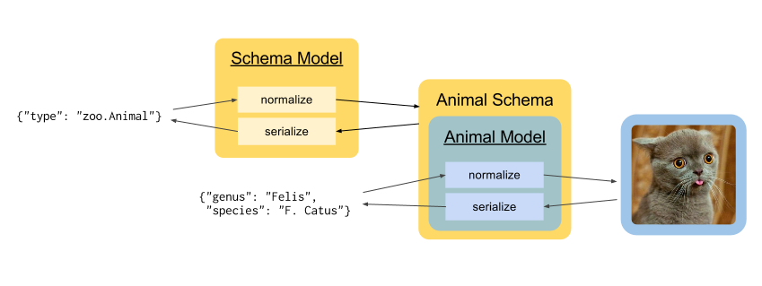

Model System
============

.. note::

    *Why invent our own JSON schema system?*
    
    Before deciding to go with our own system, we took a good look at some
    existing options. Our best candidates were `JSON Schema <http://json-
    schema.org/>`_ and `Apache Avro <http://avro.apache.org/>`_. JSON Schema
    has a significant limitation: the order of object attributes is not
    preserved. Apache Avro had a different problem: because an attribute can
    be defined as allowing multiple types, objects needed to be wrapped in an
    annotation layer to avoid ambiguity. Instead of ``{"name": "Jenn"}`` we
    would have to output ``{"Person": {"name": "Jenn"}}``. In the context of
    REST APIs, this is uncommon and potentially confusing.

    Because Cosmic must be extremely portable, it is essential that we keep
    the feature list to a minimum. In this instance, the minimum is generating
    documentation and basic validation of data structure and types. Instead of
    making you learn a new `DSL <http://en.wikipedia.org/wiki/Domain-
    specific_language>`_ for obscure validation, we encourage you to use the
    power of your language. The benefits of describing schemas in minute
    detail are greatly outweighed by the costs of growing the amount of code
    that needs to be ported.

.. glossary::

    Model

        A data type definition that consists of a normalization and a
        serialization function. The output of a model's normalization function
        must be of the same form as the input of its serialization function.
        Together, these functions define the *normalized form* of the data.

    Normalized form

        Data in its rich internal representation. For most built-in types,
        this data will consist of language primitives. In object-oriented
        languages, normalized data will often take the form of class
        instances.

    Normalization

        Turning data as provided by the JSON parser into its normalized form.
        Validation is always performed during normalization.

    Serialization

        Turning normalized data into the form expected by the JSON serializer.

Cosmic provides the following built-in types:

+-----------+-----------+-------------------+
| Type      |           |  JSON Type        |
+===========+===========+===================+
| integer   | basic     | number            |
+-----------+-----------+-------------------+
| float     | basic     | number            |
+-----------+-----------+-------------------+
| string    | basic     | string            |
+-----------+-----------+-------------------+
| boolean   | basic     | boolean           |
+-----------+-----------+-------------------+
| binary    | basic     | string (base64)   |
+-----------+-----------+-------------------+
| array     | composite | array             |
+-----------+-----------+-------------------+
| object    | composite | object            |
+-----------+-----------+-------------------+
| json      | basic     | N/A               |
+-----------+-----------+-------------------+
| schema    | composite | N/A               |
+-----------+-----------+-------------------+

Schemas
-------

.. glossary::

    Schema

        An object capable of normalizing and serializing complex JSON data.
        Internally it is a composition of models. Because schemas need to be
        passed over the wire, they are implemented as models themselves.

Because schemas are models, they have a normalized form and a JSON form. The
normalized form of a schema must provide methods to normalize and serialize
data that the schema describes. Internally, these methods delegate their work
to the actual model whose data the schema describes. A schema is effectively
a wrapper for a model:

The way the normalized form of the schema works is up to the implementation.
The serialized form (JSON form) is the primary way of dealing with schemas and
will work across implementations. From this point on, *schema* will refer to
the serialized form.

A *schema* is a recursive JSON structure that mirrors the structure of the
data it is meant to validate. Below is the grammar for a JSON schema:

.. productionlist:: schema
    schema: `simple_schema` | `array_schema` | `object_schema`
    simple_type: '"integer"' | '"float"' | '"string"' | '"boolean"' | '"binary"'
               : | '"json"' | '"schema"' | `identifier` '.' `identifier`
    simple_schema: '{' '"type"' ':' `simple_type` '}'
    array_schema: '{' '"type"' ':' '"array"' ',' '"items"' ':' `schema` '}'
    object_schema: '{' '"type"' ':' '"object"' ',' '"properties"' ':' '[' (`property`)+ ']' '}'
    property: '{' '"name"' ':' `string`  ',' '"required"' ':' `boolean` ',' '"schema"' ':' `schema` '}'
    identifier: [A-Za-z0-9_]+

In plain English, a schema is always a JSON object, it must always have a
*type* attribute. An array schema also requires an *items* attribute, which
will be a schema that describes every item in the matched array. An object
(associative array) schema requires a *properties* attribute, which will be an
array of property objects.

**An object schema cannot define two properties with the same name. Trying to
normalize such a schema must result in a validation error.**

To validate ``[{"name": "Rose"}, {"name": "Lily"}]``, you could use the
following schema:

.. code:: json

    {
        "type": "array",
        "items": {
            "type": "object",
            "properties": [
                {
                    "name": "name",
                    "schema": {"type": "string"},
                    "required": true
                }
            ]
        }
    }

Built-In Types
--------------

The normalized form of the built-in models is implementation-dependent and
will be defined in language-specific documentation. The serialized form and
the validation logic, however, is strictly the same across all
implementations. Below is a list of all built-in models and their validation
logic.

``integer``
    Must be expressed as a JSON number. If the number has a decimal, the
    fractional part must be 0.

``float``
    Must be expressed as a JSON number. Implementation should support double-precision.

``string``
    Must be expressed as a JSON string. Encoding must be UTF-8. Unicode errors
    must be dealt with strictly by throwing a validation error.

``boolean``
    Must be expressed as a JSON boolean.

``binary``
    Must be expressed as a JSON string containing Base64 encoded binary data.
    Base64 errors must result in a validation error.

``array``
    Must be expressed as a JSON array. The implementation must normalize each
    of its items against the *items* schema. If an item normalization fails
    with a validation error, the array normalization must fail too. The
    normalized form of an array must be an ordered sequence of normalized
    items, in the same order as they appear in the JSON form. If the array was
    empty, an empty sequence must be returned.

``object``
    WIP

``json``
    WIP

``schema``
    WIP
 
..
    Must be expressed as a JSON object. If the object has a key that is
    different from every property name in *properties*, a validation error
    must be thrown. Likewise, if *properties* has a required property whose
    name is not a key in the object, a validation error must be thrown. For
    every key-value pair in the object, the value must be normalized against
    the *schema* of the corresponding property in *properties*. The normalized
    form of the object must be an associative array containing

    Models
    ------

    In object-oriented languages, a model is best represented by a class. For
    simple types, this class is merely a namespace holding the corresponding
    normalization and serialization functions. For most user-defined models, the
    class has a bigger purpose: it will be instantiated at the end of the model's
    normalization procedure and the instance will be returned as the normalized
    data.

    Cosmic will normalize all incoming data and serialize all outgoing data for
    you. This means that your function can always operate on rich native data,
    leaving JSON in the model system, where it belongs.

    If you define a model as part of an API, it will become accessible via
    ``{"type": "<api>.<model>"}``.

    Raw JSON Data
    ~~~~~~~~~~~~~

    A few words need to be said about ``{"type": "json"}``. This type represents
    arbitrary JSON data. No validation is performed. You may want to use this type
    as a wildcard when you don't know in advance what the data will look like, or
    if you expect a separate system to deal with it.

    Do not use it as a way of allowing multiple types for a property. Each
    property should have just one type.

    Schema Models
    ~~~~~~~~~~~~~

    All schemas except for ``object`` and ``array`` are represented by an object
    with a single attribute *type*. To validate such a schema, the model uses the
    following meta-schema:

    .. code:: json

        {
            "type": "object",
            "properties": [
                {
                    "name": "type",
                    "required": true,
                    "schema": {"type": "string"}
                }
            ]
        }

    An array schema needs more than just *type*. It also needs *items*:

    .. code:: json

        {
            "type": "object",
            "properties": [
                {
                    "name": "type",
                    "required": true,
                    "schema": {"type": "string"}
                },
                {
                    "name": "items",
                    "required": true,
                    "schema": {"type": "schema"}
                }
            ]
        }

    An ``object`` schema requires *properties* (note that it also checks to make
    sure there are no duplicate properties):

    .. code:: json

        {
            "type": "object",
            "properties": [
                {
                    "name": "type",
                    "required": true,
                    "schema": {"type": "string"}
                },
                {
                    "name": "properties",
                    "required": true,
                    "schema": {
                        "type": "array",
                        "items": {
                            "type": "object",
                            "properties": [
                                {
                                    "name": "name",
                                    "required": true,
                                    "schema": {"type": "string"}
                                },
                                {
                                    "name": "required",
                                    "required": true,
                                    "schema": {"type": "boolean"}
                                },
                                {
                                    "name": "schema",
                                    "required": true,
                                    "schema": {"type": "schema"}
                                }
                            ]
                        }
                    }
                }
            ]
        }

    As you can see, the ``schema`` type is quite handy. Not only is it used by the
    model system internally but also by other modules in Cosmic. It allows such
    things as actions to be implemented as simple models.

A Word About Null
-----------------

The only place where ``null`` is allowed within our JSON schema system is in a
``json`` model. Trying to pass a ``null`` as the value of a property, even if
it is optional, will result in a validation error. Such a property should
instead be omitted from the payload.

The reason for this is to avoid ambiguity between ``null`` as an explicit
value and the absense of value. In JavaScript, these are represented by
``null`` and ``undefined`` respectively.

